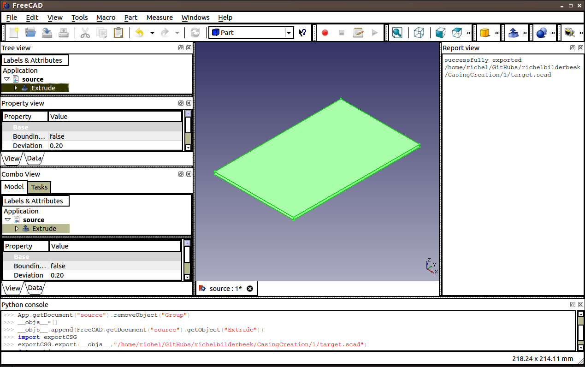
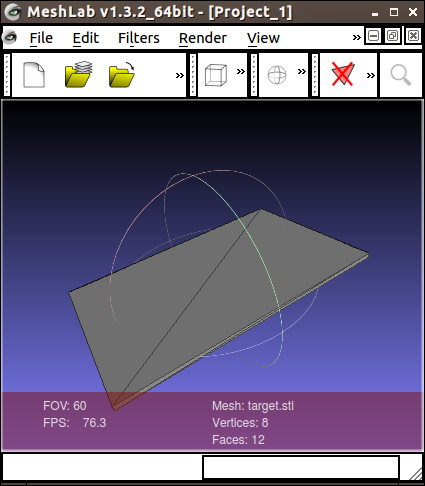

# 1

## Goal
Test conversion from FreeCAD to OpenSCAD

I expect that this works, as I can select this in FreeCAD. I expect FreeCAD to generate a file similar to one of the options in 'Appendix 5: expected target.scad'.

## Related goals

* [2: Test conversion from OpenSCAD to FreeCAD](../2/2.md)

## Experiment

 * In FreeCAD, create a cuboid, size 160x100x3 mm, save it as 'source'.
 * Export it to OpenSCAD file 'target.scad'
 * Examine 'target.scad' in OpenSCAD

## Observations

 * In FreeCAD:
    * I created a Sketch and saved it as 'source.fcstd' and 'source.fcstd1'
    * I added the third dimension by padding it with 3 mm
    * converting it to .scad has two results: either an error message 'Appendix 1: Error message 1', later it created a near-empty file 'target.scad' (see 'Appendix 4: near-empty file target.scad')
    * converting it to .stl works, see 'Appendix 2: Screenshot 1'
    * I threw away the part, I made it three dimensional with 'Create a ruled surface' on the opposing edges, then extruding by 3 mm
    * converting it to .scad works without errors, FreeCAD created a near-empty file 'target.scad' (see 'Appendix 4: near-empty file target.scad')



  * In FreeCAD, converting the part (in .fcstd) to .stl 'target.stl' works 

.

 * Perhaps importing the STL in OpenSCAD works? Nope, cannot import an STL in OpenSCAD
 
The state of OpenSCAD exports is unsure, but there is no evidence it is compled, see 'Appendix 3: Forum Thread 1'.

I posted this error on the FreeCAD forum, [here](http://forum.freecadweb.org/viewtopic.php?f=19&t=6803&p=0&e=0&sid=9893721e94c8a15394860cd022dc6d39).

## Conclusions

Actually, a working hypothesis: conversion from .fcstd to .scad is not yet (as of 2014-06-11) implemented.

### Appendix 1: Error message 1

```
Traceback (most recent call last):
  File "<string>", line 4, in <module>
  File "/usr/lib/freecad/Mod/OpenSCAD/exportCSG.py", line 263, in export
    process_object(csg,ob)
  File "/usr/lib/freecad/Mod/OpenSCAD/exportCSG.py", line 240, in process_object
    csg.write('%s\n' % shape2polyhedron(ob.Shape))
  File "/usr/lib/freecad/Mod/OpenSCAD/exportCSG.py", line 98, in shape2polyhedron
    params.GetFloat('meshdeflection',0.0)))
<type 'exceptions.Exception'>: Wrong arguments
Stack Trace: Traceback (most recent call last):
  File "<string>", line 4, in <module>
  File "/usr/lib/freecad/Mod/OpenSCAD/exportCSG.py", line 263, in export
    process_object(csg,ob)
  File "/usr/lib/freecad/Mod/OpenSCAD/exportCSG.py", line 240, in process_object
    csg.write('%s\n' % shape2polyhedron(ob.Shape))
  File "/usr/lib/freecad/Mod/OpenSCAD/exportCSG.py", line 98, in shape2polyhedron
    params.GetFloat('meshdeflection',0.0)))

Traceback (most recent call last):
  File "<string>", line 4, in <module>
  File "/usr/lib/freecad/Mod/OpenSCAD/exportCSG.py", line 263, in export
    process_object(csg,ob)
  File "/usr/lib/freecad/Mod/OpenSCAD/exportCSG.py", line 240, in process_object
    csg.write('%s\n' % shape2polyhedron(ob.Shape))
  File "/usr/lib/freecad/Mod/OpenSCAD/exportCSG.py", line 98, in shape2polyhedron
    params.GetFloat('meshdeflection',0.0)))
<type 'exceptions.Exception'>: Wrong arguments
Stack Trace: Traceback (most recent call last):
  File "<string>", line 4, in <module>
  File "/usr/lib/freecad/Mod/OpenSCAD/exportCSG.py", line 263, in export
    process_object(csg,ob)
  File "/usr/lib/freecad/Mod/OpenSCAD/exportCSG.py", line 240, in process_object
    csg.write('%s\n' % shape2polyhedron(ob.Shape))
  File "/usr/lib/freecad/Mod/OpenSCAD/exportCSG.py", line 98, in shape2polyhedron
    params.GetFloat('meshdeflection',0.0)))

```


### Appendix 3: Forum thread 1 
[According to the forum](http://forum.freecadweb.org/viewtopic.php?f=10&t=2395&p=17777&hilit=export+scad+openscad+import#p17777) FreeCAD does not support
export to OpenSCAD:

```
Export FreeCAD to OpenSCAD CSG.

Postby keithsloan52 » Wed Mar 21, 2012 7:45 pm
I have started an exporter for FreeCAD to OpenSCAD CSG format.

Its available at http://www.sloan-home.co.uk/Export/Export.html
```

```

Re: Export FreeCAD to OpenSCAD CSG.

Postby keithsloan52 » Fri Mar 23, 2012 12:06 pm
shoogen I think you are getting way way ahead of the game.

The long term plan is to produce an export for CSG and also an export for SCAD, but thats a long term aim,
At the moment I intend to concentrate on export CSG
```

### Appendix 4: near-empty file target.scad

```
// CSG file generated from FreeCAD Export 0.1c
group() {
 group(){
}
}
```

### Appendix 5: expected target.scad

```
//Create the cuboid, one of its points is at origin
cube([160,100,3]);
```

or

```
//Create the cuboid, center on origin
cube([160,100,3],center=true);
```


or

```
//Create the cuboid, translate its center to origin
translate([-80,-50,-1.5]) { cube([160,100,3]); }
```


### Appendix 6: my system

```
OS: Ubuntu 14.04 LTS
Platform: 32-bit
Version: 0.14.2935 (Git)
Branch: master
Hash: eab159b6ee675012bf79de838c206a311e911d85
Python version: 2.7.6
Qt version: 4.8.6
Coin version: 4.0.0a
SoQt version: 1.6.0a
OCC version: 6.7.0
```

Not that I actually use Lubuntu 14.04 LTS.
