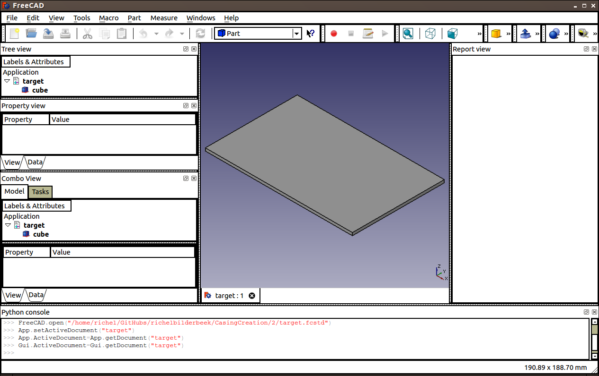

# 2

## Goal

2: Test conversion from OpenSCAD to FreeCAD

I expect that this works, as FreeCAD has an OpenSCAD mode. In this experiment I will not use that environment: I will create the file in OpenSCAD.

## Related goals: 

 * [1: Test conversion from FreeCAD to OpenSCAD](../1/1.md)
 * [3: Test conversion from OpenSCAD (within FreeCAD) to FreeCAD](../3/3.md)

## Experiment

 * In OpenSCAD, create a cuboid, size 160x100x3 mm, save it as 'source'.


 * In FreeCAD, start the 'OpenSCAD' Workbench, load 'source.scad', export to target.fcstd
 * In FreeCAD, open 'target.fcstd'




 * In FreeCAD, export it to OpenSCAD again

```
// CSG file generated from FreeCAD Export 0.1c
group() {
 group(){
multmatrix([[1.0, 0.0, 0.0, -80.0], [0.0, 1.0, 0.0, -50.0], [0.0, 0.0, 1.0, 1.5], [ 0, 0, 0, 1]]){
cube (size = [160.0, 100.0, 3.0], center = true);
}
}
}
```

## Observations


## Conclusions
