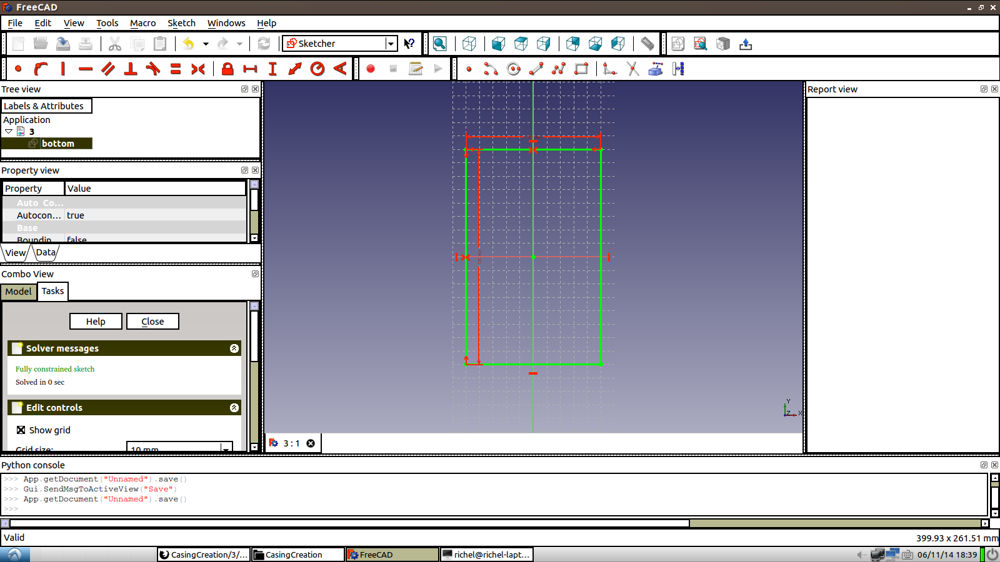

# 3: Create a simple box in FreeCAD

## Goal

Create a simple box in FreeCAD

## Experiment

 * In FreeCAD, create a 2D sketch of the bottom plate of 160x100
 * In FreeCAD, create a 2D sketch of a side plate of 160x(100-3-3=)94 mm
 * In FreeCAD, create a 2D sketch of the front plate of (100-3-3=)94x(100-3-3=)94x3 mm
 * Merge these somehow?
 * Add other lines to 2D sketches

## Observations

 * In FreeCAD, create a 2D sketch of the bottom plate of 160x100

 * In FreeCAD, create a 2D sketch of a side plate of 160x(100-3-3=)94 mm

 * In FreeCAD, create a 2D sketch of the front plate of (100-3-3=)94x(100-3-3=)94x3 mm

 * Merge these somehow

I think that the 2D sketches must contain the lines that can be used by other dimensions. I think I need to make all 2D sketches 100x100 or 160x100, so extruded shapes can find their place.

 * Add other lines to 2D sketches
